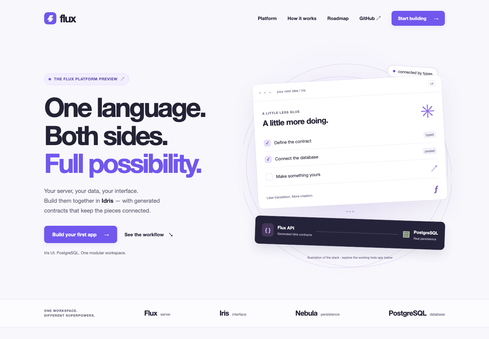
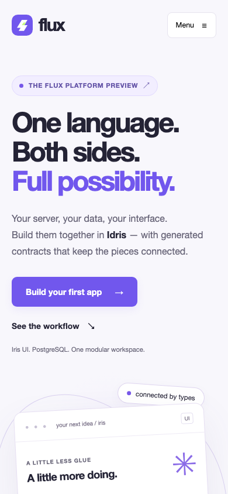

# Flux landing page verification

The native Flux server build and real Chromium checks passed on macOS.
The complete workspace gate also passed **all 21 steps**; `results.json` and
`driver.log` record that run. The landing-specific build/browser logs are included.
Existing integration logs remain available in the local timestamped workspace
report directory identified by the driver.

Landing checks cover:

- Actual Flux HTTP responses, asset MIME/status checks, strict CSP and security
  headers on errors, rejected source/traversal paths and unsupported methods.
- Desktop/tablet/mobile page widths (1440, 1024, 768, 390 and 320 pixels).
- Keyboard-operated server/client tabs, mobile navigation and Escape focus.
- Clipboard success and denied-permission feedback, native FAQ disclosure,
  reduced motion, working section links and no third-party asset requests.
- A JavaScript-disabled browser with visible navigation and both code samples.
- No browser script/CSP errors; clean native server shutdown.

An initial tablet-width check caught decorative orbits extending the page's
scrollable area. Their own clipping frame fixes that without hiding overflow
on the entire document. The final checks and captures below passed afterward.

## Desktop

## Mobile

The full-height capture is generated under `.workspace/landing/full-page.png`.
This is functional and visual macOS/Chromium evidence, not an exhaustive
accessibility audit, all-browser certification or a GitHub-hosted Linux CI run.
The root CI gate now includes the landing build and browser test.
